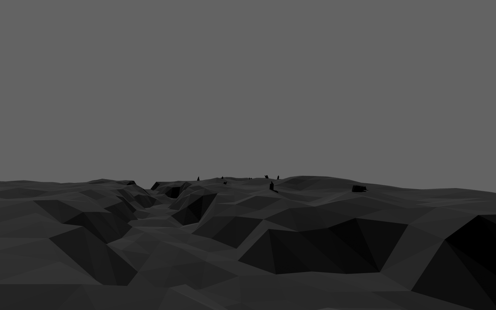
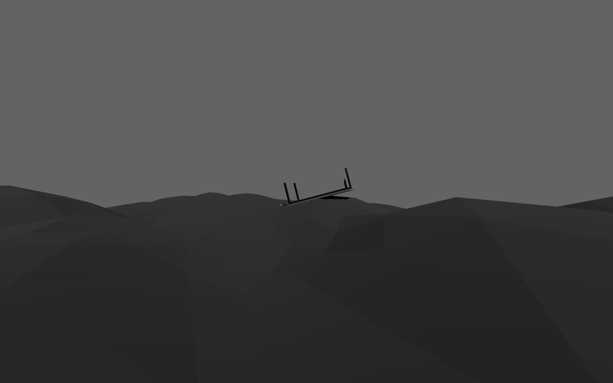
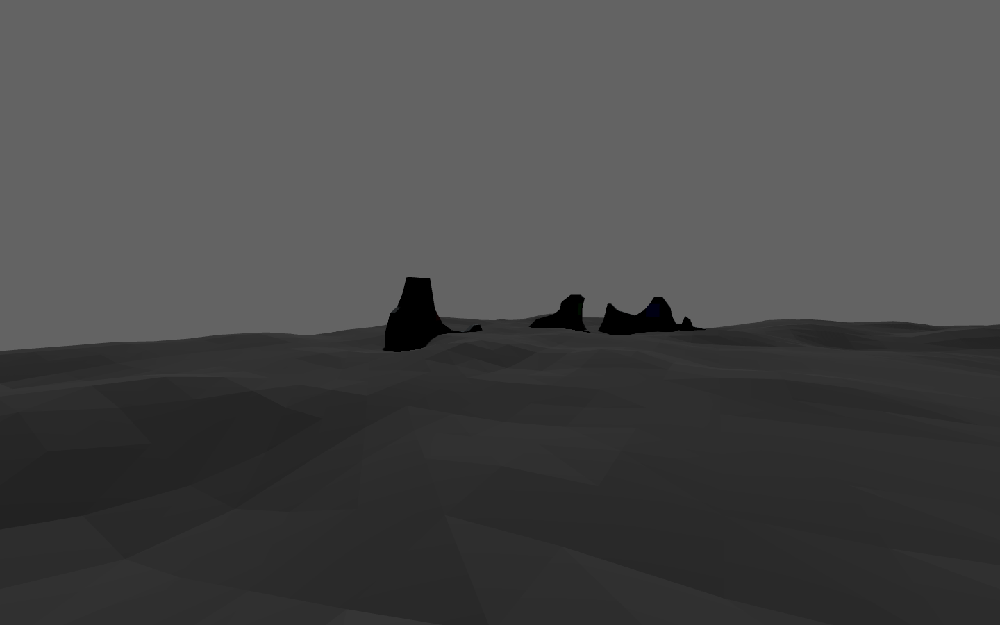
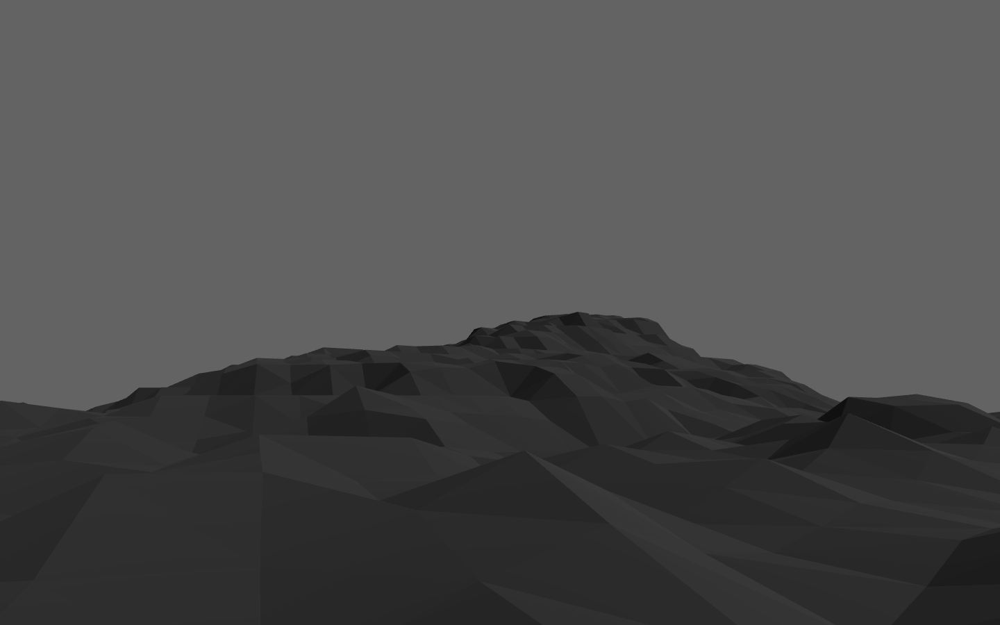
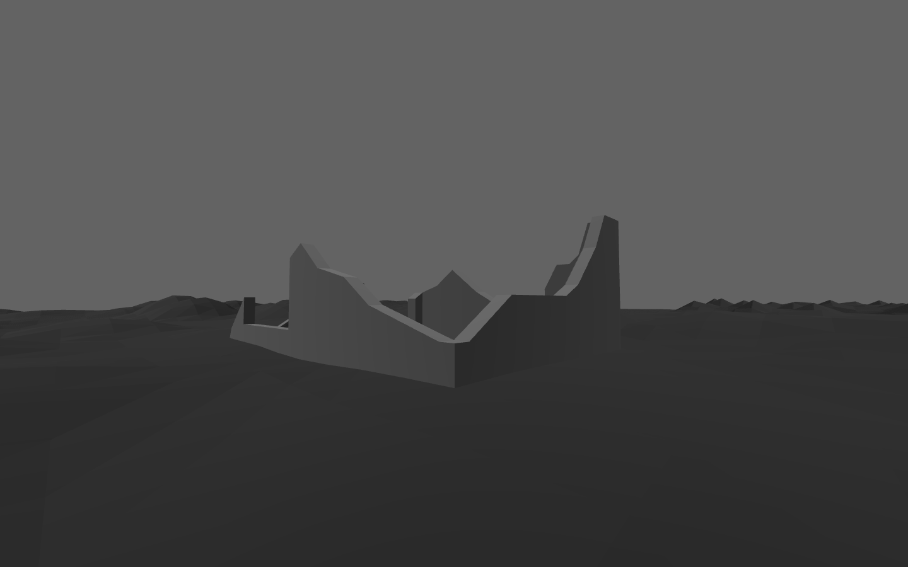
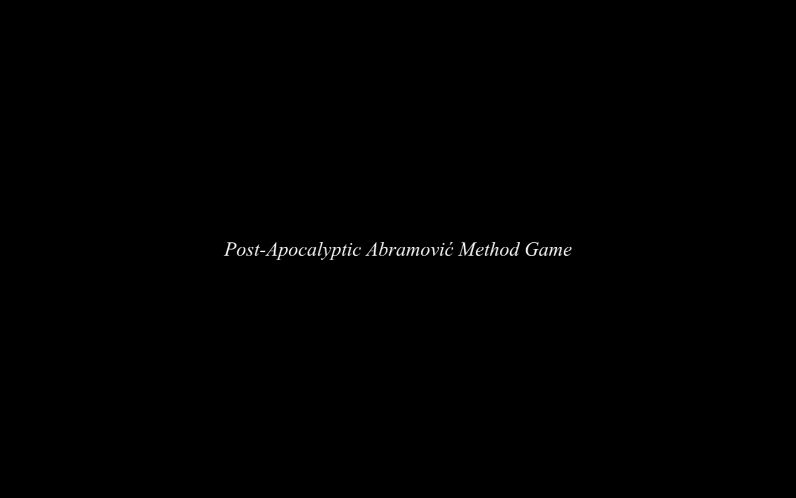
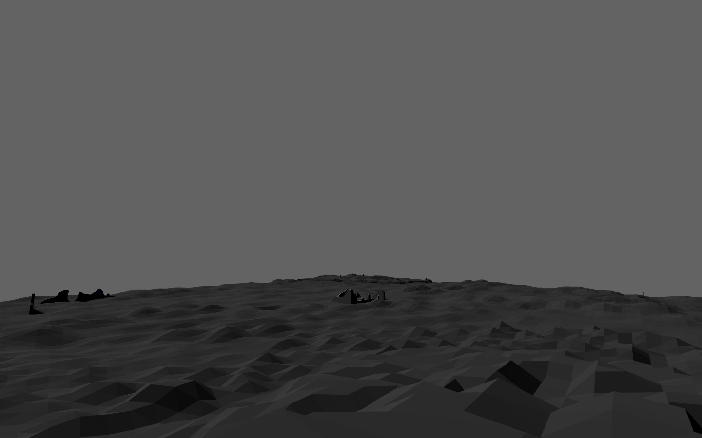

# *Post-Apocalyptic Abramović Method Game*

## Information
* Released: 15 April 2016
* Website: http://www.pippinbarr.com/
* Platforms: Mac, Windows, Browser
* Link: https://www.pippinbarr.com/post-apocalyptic-abramovic-method-game/info
* Price: Free.

## Description
The sky is grey! The birds all flew!
There's no more trees for complaining to!
The table's turned! The rice is gone!
The world is over, but the Method is strong!

## History
Post-Apocalyptic Abramovic Method Game is a spiritual sequel to my earlier Abramovic Method Games which recreated certain exercises from Marina Abramovic's "Abramovic Method" in the form of computer games. In Post-Apocalyptic Abramovic Method Game we move forward in time to a post-apocalyptic future in which the world has been more or less destroyed and the player finds themselves participating in (or perhaps investigating) the exercises in this new context. The game was going to be in 2D for a long time, but I could never quite work out how to represent the ideas that way, so it was amazing to me when I realised I could make it in Unity in 3D instead. That led to thinking about the game more as a "place" than a post-apocalyptic recreation of the exercises/games themselves, which is where I ended up with it.

## Features
* A ground beneath your feet!
* A table!
* No rice or black sesame!
* "Trees"!
* Colours?

## Images

## Trailer
[View the trailer on YouTube](https://youtube.com/watch?v=xIavx_fCUUY)

## Credits
* Pippin Barr: Everything
