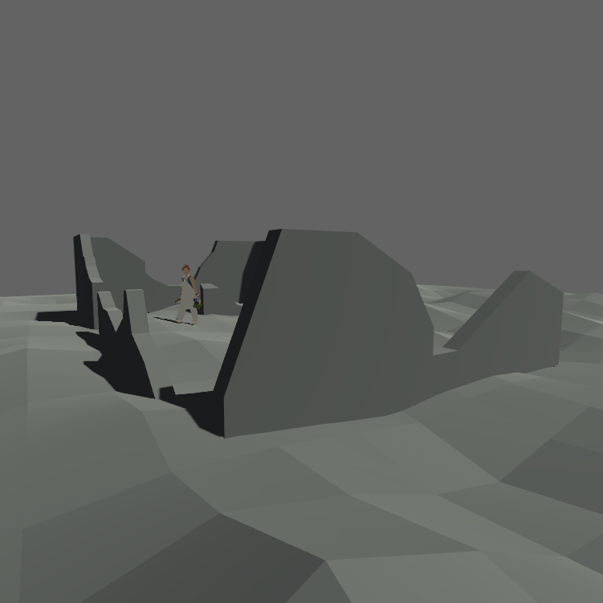

# Blog Posts

Here are the public-facing blog posts I wrote while working on the game.

## One Apocalypse Later... (2016-03-28)

I've started working on a new game after the release of _[Eveline](http://www.pippinbarr.com/eveline/info)_, trying to pick up the pace a little bit as it's been hard to focus in on making things so far this year somehow. The new thing is currently titled _Post-Apocalyptic Abramovic Method Games_. It's a pretty solid title – it's one of those games where the title came first, in fact, so I doubt the title will change over the course of development. It's a tells-it-like-it-is title. Titles are important.

I actually starting thinking about making this particular game quite a while ago, about this time last year in fact. I thought of the title and the general concept of the _[Abramovic Method Games](http://www.pippinbarr.com/abramovic-method-games/info/)_ set in a post-apocalyptic future – playing on the idea of long-durational work that's central both to the Abramovic Method and Marina Abramovic's practice in general. I like the weirdness of thinking about doing meditative exercises after the world's been destroyed, the idea of a place you would go to to "get away from it all" and focus on inner awareness etc., in a wasteland. So that's the concept. Ha ha.

But originally it was going to be a 2D thing where I'd essentially remake the existing _Abramovic Method Games_ in a related way but with a post-apocalyptic spin – somehow glitched out, say, or the trees would be dead and charred. But I really struggled to work out how to do it, even though I loved the concept. Sometimes your specific ideas about execution just don't serve the idea and you're pretty much screwed at that point.

So I left it alone for quite a while, until thinking about the idea of doing it in 3D in a triumphant (terrified) return to using Unity (after the difficult but largely acceptable work on _[The Stolen Art Gallery](http://www.pippinbarr.com/the-stolen-art-gallery/info)_). And in fact doing it in 3D gets at the idea of a _place_ that feels appropriate in this remake – getting at some of the ideas of a "retreat" and so on that aren't so present in the previous game, which was more focused on explicitly remediating the exercises to digital form.

So 3D is the plan. Unity and SketchUp are the tools. The image at the top of this is how far I've got in terms of setting a visual style for the game, and I'm happy with it I think (I'm also happy that there's a SketchUp Woman for scale now, and not just the Stan Lee guy). I'm trying to keep it as simple as possible because my skills with the tools are... simple. I'm making the landscape using SketchUp's sandbox tools, notably the very fancy-sounding TIN (triangulated irregular network) and the embarrassingly named "Smoove" tool. And the rest is all just pushing and pulling shapes etc. and importing it into Unity and using the still-great [First Person Drifter](http://www.torahhorse.com/First-Person-Drifter-Controller-for-Unity3d-1) script for controlling an avatar.

And that's where it's at. Now you know. Wipe that tear from your eye, it's okay.

## Post-Apocalyptic Post-Mortem (2016-04-08)

I seem to be largely done with my work on the new project, now called _Post-Apocalyptic Abramovic Method Game_, so I thought I should write some words to try to work out what I thought or think I was doing with it.

For one thing, I changed the name so it's singular and not plural now – originally the game was going to be the five exercises (counting the rice and sesame, looking at the colors, stepping on the ground, stopping the anger, complaining to a tree) each set in its own little diorama world, and you would kind of jump off the edge of one to get to the next. But the small worlds felt too small, too obviously toy-like, and thus not especially post-apocalyptic, which seems to speak of a need for a larger horizon. So now all the exercises are on one swathe of terrain, and the whole thing is just one game now. Also, to be absurdly technical, none of the actual exercises in this game are "games" for me – you can't do anything in the world except walk around and see the detritus of the Method. You could perform the Method yourself in response to what you see, but really each thing is not mechanically a game in the way it was in the _[Abramovic Method Games](http://www.pippinbarr.com/2014/09/29/abramovic-method-games/)_. Rather, the whole thing is a "game" constructed to play with the ideas of the previous games and the Method itself. Okay? Okay.

The way the new game works is that you wake up as someone (or something, or some presence) going on an Abramovic Method retreat somewhere in the country/woods, except that the apocalypse has happened and the world is a dead wasteland now. So you wake up in your once-nice retreat house, which is mostly destroyed, and wander off to take part in the exercises around the environment. I like the idea that you're both a kind of the ghost of a committed Method practitioner and also a kind of archeologist of the objects/ideas of the Method that are still around after the unspecified catastrophic event (and presumably after many years). You could take on either of those roles (or both?) as you relate to the world of the game.

Centrally, the whole game is also conceived as a joke (because I'm me) about the idea of "long durational performance". The proposition being that the Method itself is a performance, and the game asks the question of how long it can &#8216;last for', including through an apocalyptic catastrophe and beyond. This also probably plays into Marina Abramovic's ideas around legacy, particularly the Method as something she can leave behind for the world. But of course if we're talking about a wasteland with destroyed trees and broken walls, did the Method survive after all? You be the judge!

Big questions, little game, poorly formulated words. Goodnight.
